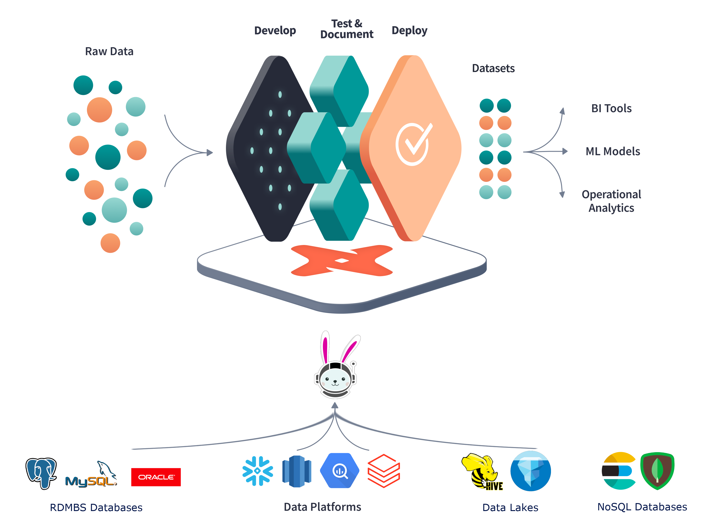

# dbt-exploration
A repo of Jms' exploration into dbt.

## Setup
Based on dbt + trino with a streamlit frontend.
- [Trino](https://trino.io/) is a distributed SQL query engine for big data analytics.
- [dbt](https://www.getdbt.com/) is a tool that enables data analysts and engineers to transform data in their warehouse more effectively.
- [streamlit](https://streamlit.io/) is an open-source app framework for Machine Learning and Data Science teams.
- [Trino episode 21](https://trino.io/episodes/21.html)
- [Trino + dbt Demo](https://github.com/victorcouste/trino-dbt-demo)

## Usage (local - docker + trino)
- `docker run --name trino -d -p 8080:8080 --volume ./etc/trino:/etc/trino trinodb/trino`
- `docker run --name trino -d -p 8080:8080 trinodb/trino`
- `docker ps` - check that the container is running (check healthy)
- `docker exec -it trino trino --server localhost:8080 --catalog tpch --schema sf1`
- `docker exec -it trino trino`
- `select count(*) from tpch.sf1.nation;`

## Usage (local - docker + kubernetes/ minikube + trino + postgres + kafka + zookeeper)
- `minikube start`
- `minikube dashboard`
- install [helm](https://helm.sh/docs/intro/install/)
    - `brew install helm`
- `helm repo add bitnami https://charts.bitnami.com/bitnami`
- `helm search repo bitnami`
- **Set up mysql**
- `helm install new-mysql bitnami/mysql`
- get the password
    - `kubectl get secret --namespace default new-mysql -o jsonpath="{.data.mysql-root-password}" | base64 --decode`
- run a pod that you can use as a client
    - `kubectl run new-mysql-client --rm --tty -i --restart='Never' --image  docker.io/bitnami/mysql:8.0.34-debian-11-r56 --namespace default --env MYSQL_ROOT_PASSWORD=$MYSQL_ROOT_PASSWORD --command -- bash`
- connect to mysql
    - `mysql -h new-mysql.default.svc.cluster.local -uroot -p"$MYSQL_ROOT_PASSWORD"`
    - `show databases;`
    - `use mysql;`
    - `show tables;`
    - `select * from user;`
    - `exit`
    - leave the pod
        - `exit`
- **Set up postgres**
- `helm install new-postgres bitnami/postgresql`
- get the password
    - `kubectl get secret --namespace default new-postgres-postgresql -o jsonpath="{.data.postgres-password}" | base64 -d`
    - `export POSTGRES_PASSWORD=$(kubectl get secret --namespace default new-postgres-postgresql -o jsonpath="{.data.postgres-password}" | base64 -d)`
- run a pod that you can use as a client
    - `kubectl run new-postgres-postgresql-client --rm --tty -i --restart='Never' --namespace default --image docker.io/bitnami/postgresql:16.0.0-debian-11-r3 --env="PGPASSWORD=$POSTGRES_PASSWORD" \
      --command -- psql --host new-postgres-postgresql -U postgres -d postgres -p 5432`
    - `select * from pg_catalog.pg_tables;`
    - `exit`
    - `kubectl port-forward --namespace default svc/new-postgres-postgresql 5432:5432 &
    PGPASSWORD="$POSTGRES_PASSWORD" psql --host 127.0.0.1 -U postgres -d postgres -p 5432`
    - `select * from pg_catalog.pg_tables;`

## Demo
- `dbt init` - create a new dbt project
- `mf tutorial` - run the dbt tutorial

## Other
- `oc import-image oracle-db-image --from=container-registry-amsterdam.oracle.com/database/enterprise:19.3.0.0 --confirm`

## Attempting to run an oracle db in a container
- https://container-registry.oracle.com/ords/ocr/ba/database/free
- https://container-registry.oracle.com/ords/ocr/ba/database/enterprise
- `docker pull container-registry.oracle.com/database/free:latest` or 
- `docker pull container-registry-amsterdam.oracle.com/database/enterprise:19.3.0.0`
- `docker run -d --name new-oracle -p 1530 container-registry.oracle.com/database/free:latest`
- `docker ps` - check that the container is running (check healthy)
- `docker port new-oracle`
- `docker exec -it new-oracle sqlplus / as sysdba`
- `SELECT owner, table_name FROM dba_tables;`
- `create user C##jms identified by mypassword;` - create a new user
- list users
    - `select username from dba_users;`
    - `select username from all_users;`
    - `select username from user_users;`
- `grant sysdba to C##jms;` - grant sysdba to the user
- `grant all privileges to C##jms;` - grant all privileges to the user
- create table
    - `create table C##jms.test (id number, name varchar2(20));`
    - `insert into C##jms.test values (1, 'james');`
    - `select * from C##jms.test;`
- `exit`
- log in with the new user (within the container)
  - `docker exec -it new-oracle sqlplus C##jms/mypassword@localhost/ORCL`
- log in using a locally installed version of sqlplus (outside the container)
  - `sqlplus C##jms/mypassword@localhost:1530/FREE` (to install on mac use `brew install InstantClientTap/instantclient/instantclient-sqlplus`)
  - (`sqlplus system/<your_password>@//localhost:<exposed_port>/<your_SID>`)